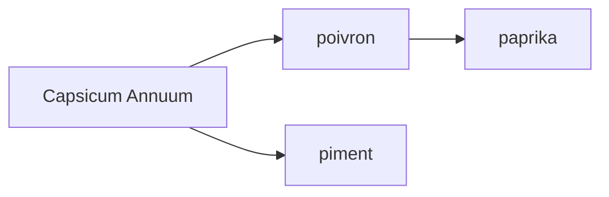

- paprika : poivron séché broyé
    - doux : juste le fruit
    - fort : avec les graines (sans le blanc ?)

    - fumé : (espagne) odeur chorizo

- Origine : Hongrie ou Espagne (pimenton)
- En Hongrie : `paprika` désigne le `Capsicum`, qui est la famille des poivrons et des piments
- En France : `paprika` désigne l'épice issue du poivron
