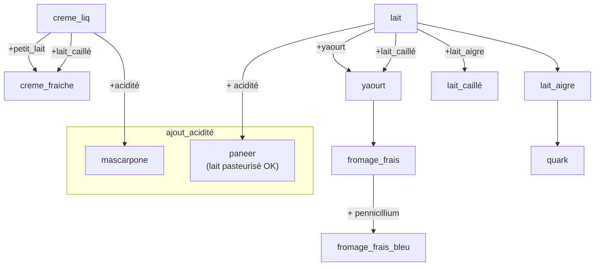

- mascarpone
    - fromage gras à pâte fraîche
    - fait depuis la crème chauffé à 100°C avec citron ou vinaigre
    - 40% matière grasse
- ricotta
    - fromage gras à pâte fraîche
    - empresurage (chauffe l'eau jusque 35°C, puis acidifié par jus de citron ou vinaigre)... https://fr.wikipedia.org/wiki/Ricotta
    - 
- fromage blanc
    - 0%, 20%, 40% de matière grasse est sur l'extrait sec
    Le vrai pourcentage est 0%, 3.5% et 7%
    - ferment + bactérie lactique
    - https://fr.wikipedia.org/wiki/Fromage_blanc

- yaourt 
    - lait fermenté. Donc ajout de bactérie lactique mais pas de ferment

# Fabrication des crèmes

- pour obtenir de la crème, on part du lait chauffé à 35°C dans une écrémeuse-centrifugeuse  
on récupère le gras, qui est la crème
    - si on la pasteurise, on a la crème fleurette
    - si on la stérisilise, on a de la crème liquide

- pour épaissir cette crème, on a besoin d'acidité (ensemencement)
    - avec ferment : (goût acide) devient crème épaisse
    - avec acide lactique : (goût doux) devient mascarpone, cottage cream, panna

- crème épaisse  
- à partir de lait cru : crème épaisse cru
- à partir de lait pasteurisé : crème fraiche épaisse

## Autres crèmes

- crème aigre ou crème acide (Europe de l'est) : obtenue par fermentation bactérienne
- crème double (Suisse) : pas de ferment. On récupère juste le dessus du lait
- crème fouettée : crème liquide / fleurette fouettée
- crème chantilly : crème fouettée sucrée

# Transformation du lait

Référence au livre "L'art de faire son Fromage" de David Asher :
- lait caillé   : p 126, 166
- lait aigre    : p 126, 302
- yaourt        : p 112
- fromage frais : p 122 (et avec presure p xxx)
- penicillium   : p 219
- paneer        : p 130
- quark         : p 125, 216

Recette à faire du-dit livre :
- saint marcellin : p 154
- beurre          : p 295

Quelques notes :
- lait caillé = lait aigre, selon p 126...
- babeurre = lait de baratte = lait ribot (p 293)
    - on pourrait le remplacer par
        -  250 ml lait, 15 ml vinaigre, repos 5 mn
        -  ? lait, 250 ml viangire, chauffer 10 mn. Ca épaissira