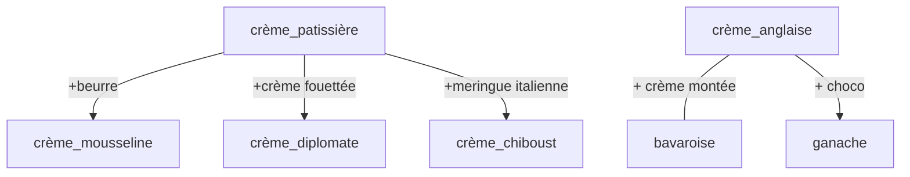

- crème patissière (éclair, religieuse, chou, st honoré)
	- ...ajout de beurre : crème mousseline (tropézienne, paris-brest)
	- ...gélifié
		- ...ajout crème fouettée : diplomate (fraisier, mille-feuille)
		- ...ajout de meringue italienne : crème chiboust (st honorté, tartelette)

- crème au beurre (opéra)

- crème anglaise
	- ... ajout crème montée (bavaroise)
	- ... ajout de choco : ganache crémeuse (opéra, forêt noire)

Note : garder les bulletpoints : plus clair
