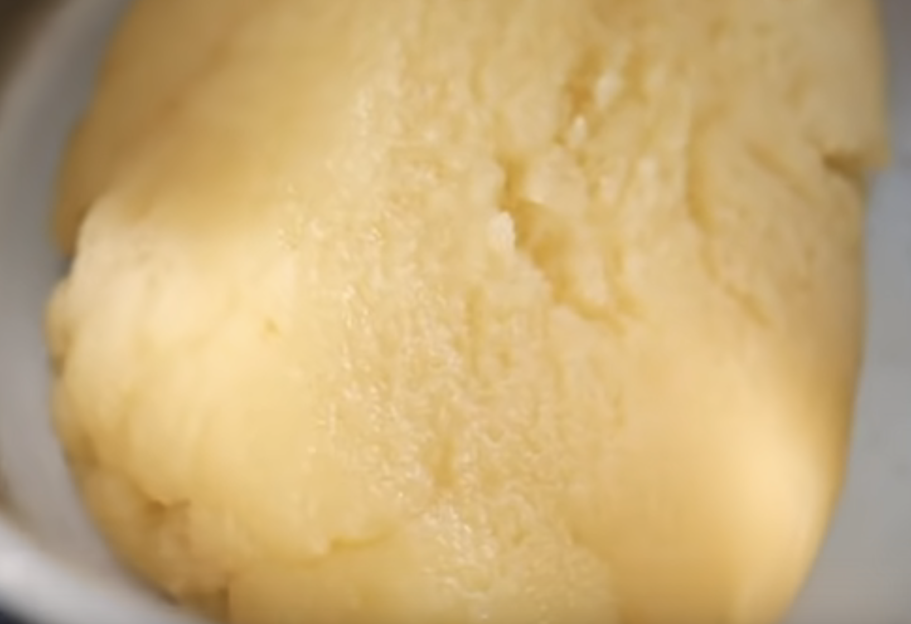
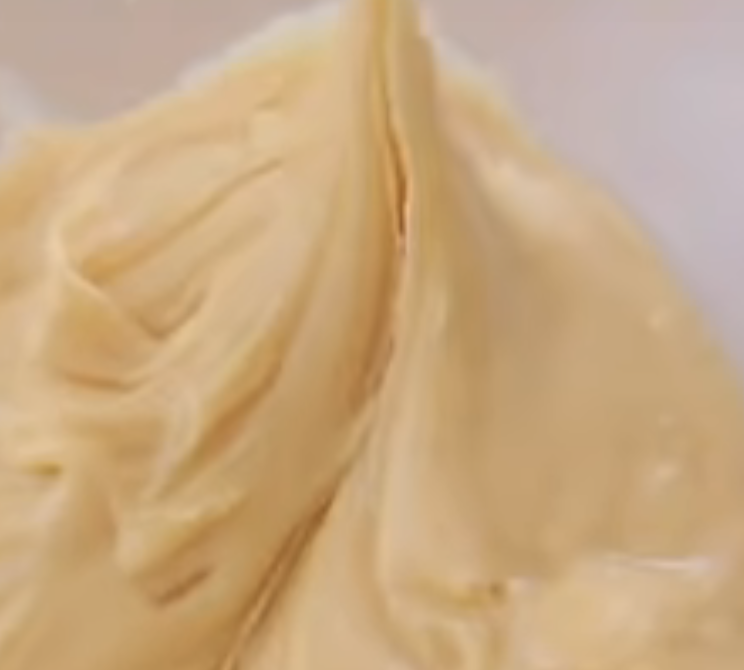
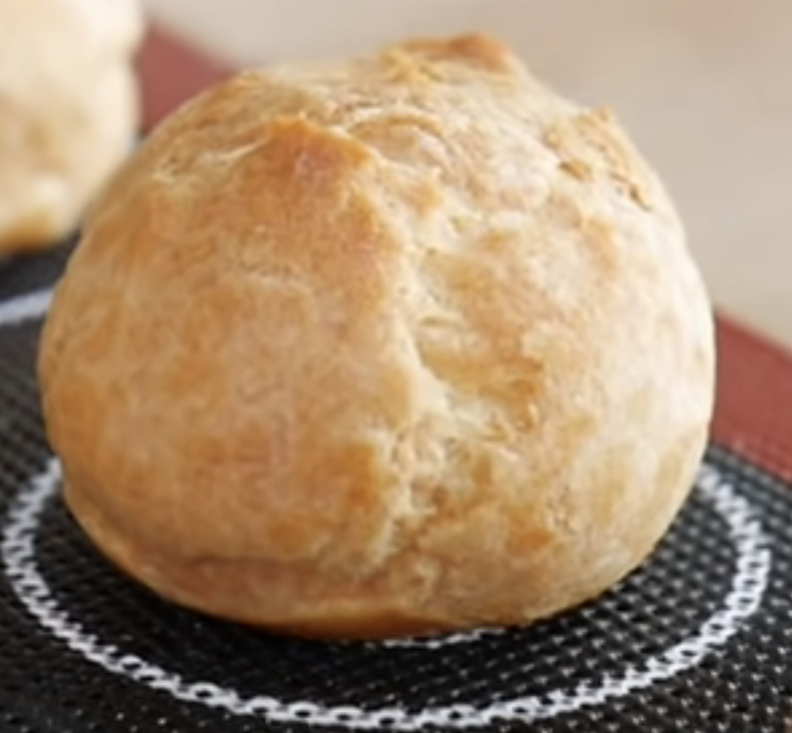

## pate a choux

| ingrédients | book    | moi | astuce | astuce-calc | merc | merc-calc | test | 1/4/8/16   | 1/4/8/16 calc | you cap |you cap calc |
| :---------- | :------ | :-- | :----- | :---------- | :--- | :-------- | :--- | :-------   | :---------    | :-------|:------------|
| farine      | 110     | 125 | 85     | 110         | 150  | 110       | 110  | 200        | 110           | 150     | 110         |
| beurre      | 90      | 90  | 65     | 84          | 125  | 92        | 80   | 100        | 55            | 100     | 75          |
| oeufs       | 200 (4) | 3   | 160    | 207         | 265  | 194       | 3    | 280? (4)   | 154 (2)       | 200-250 | 145-180     |
| tot liquide | 200     | 175 | 150    | 194         | 250  | 182       | 150  | 250        | 138           | 250     | 180         |
|   lait      | 100     |     |        |             | 83   | 60        | 75   |            |               |         |             |
|   eau       | 100     | 175 | 150    | 194         | 167  | 122       | 75   | 250        | 138           | 250     | 180         |
| sucre       | 2       |     | 2      | 2           | 5    | 3         |      |            |               | 10      | 7           |
| Sel         | 2       |     | 2      | 2           | 4    | 2         |      |            |               | 5       | 3           |

Résultat
- 1
    - test n'a pas marché (il faut bien déhydrater avant les oeufs)
        - qui est un mix de "moi" et "book"
    - 2° essai avec la récette "moi" : pas marché non plus 
        - à cause de T65 ? je n'avais plus de farine
        - à cause du fait que cette pate à choux est pour les gougères ? (ie. pas besoin de gonflé)
    - TODO: regarder à nouveau la vidéo "astuce" 
- 2
    - recette 1/4/8/16 (proportion 1, 4, 8, 16)
        - 1L eau, 400g beurre, 800g farine, 16 oeufs (16*70g)
    - resultat : 
        - plutot bon
        - four 230° jusqu'au développement (~12mn), puis 180° (~10mn)

info / conseil :
- utilité des ingrédients : https://thefrenchpatissier.com/pate-a-choux-inratable-astuces/
    - amidon : elasticité, gonfle, structure finale
        - ? préférer farine T55 pour moins de gluten, qui empêche de gonfle ?
    - oeuf : fige le chou, cavité
    - gras : moelleux, evite l'éclatement à la cuisson. Alourdit la pate
- apparemment, eau = choux dur, lait = choux mou
    - full eau : risque de craquement à la cuisson (réduit par le gras, du lait)
    - si trop gras, le poids peut écraser le gonflement
- classiquement le poids des oeufs doit être égal au poids de liquide. 

- pochage : utiliser douille petite four (courrone dentée) pour faire des stries, et limiter que ça craque à cuisson

- à la cuisson, si la pate n'est pas assez cuite, elle risque de retomber
    - il vaut mieux trop la cuire, que pas assez
- ouvrir le four à mi-cuisson ?
    - certains disent que le choc thermique fait tomber le choux
    - d'autres que ça évacue l'humidité du four et permet d'assécher la pate, et durcit le choux
- four chaleur statique ?

source principale : 
- Francois Regis Gaudry : https://www.youtube.com/watch?v=jiNsg9XqrrM (ingrédient = "moi")
- astuce : https://www.youtube.com/watch?v=Xrh4rrD0g5c
- [astuce et expli Raphael Haumont](https://www.allodocteurs.fr/eclair-au-chocolat-maison-la-recette-savoureuse-et-allegee-de-raphael-haumont-35768.html)

- [you cap](https://www.youtube.com/watch?v=FS7I_-jxmGs)
    - réalisation pate
- pas mal de conseil : https://www.mycake.fr/pate-a-choux/

- [chimie et amidon](https://jepensedoncjecuis.com/2016/01/lamidon-lami-precieux-et-complexe-du_20.html)

### recette https://www.youtube.com/watch?v=Xrh4rrD0g5c
+ https://www.mercotte.fr/generalites-sur-les-pates-astuces-et-tours-de-main/

- beurre, eau, sel, sucre à frémir --> objectif faire fondre le beurre sans faire évaporer l'eau
    - le beurre doit complètement être fondue, sinon pate huileuse pas homogène
- porter ebullition, hors du feu, ajouter farine, mélanger --> jusque pate homogène (et épaisse)
    - chaud pour faire exploser amidon, et créer empois d'amidon, pour élasticité et gonfler
    - surement des infos dans [chimie et amidon](https://jepensedoncjecuis.com/2016/01/lamidon-lami-precieux-et-complexe-du_20.html)
- c'est désormais une panade

- désècher la pâte
    - remettre casserole sur feux doux (~5mn), en touillant et cassant la panade à la spatule pour faire évoporer un maximum d'eau
    - (1-2mn par 250g de liquide)
    - à faire jusqu'à ce que 
        - pate lisse, qui se décolle de la casserole

        - lorsqu'on agite la casserole, la pâte s'agglomère toute seule.
        - Elle doit être homogène et légèrement satinée
        - une fine pellicule au fond

    - si pas assez sèche : pas gonflé
    - trop sèche : gonflé mais s'ouvrir

- le mettre dans un cul de poule et mélander un peu pour tiédir
    - si panade trop chaude, ça coagulent, et les protèines sont moins bonnes pour faire gonfler

- ajouter les oeufs 1 à 1, et incorporer (ou les fouetter avant)
    - la texture doit être lisse, souple, brillante, un peu liquide
        - en coupant à la spatule, la pâte doit se refermer lentement
        - en soulevant la spatule, la pâte est souple, et forme un ruban élastique se détachant coupant net

- pocher de suite (tiède), ne pas tourner
    - ou laisser à température ambiante ?
- technique de pochage : https://www.youtube.com/watch?v=ntqDgI70dYE
    - appuyer sur la poche, acommpagner la pate en remontant (faire un tas). Pour finir, faire une virgule
    - ne pas tourner

- cuisson
    - question
        - ouvrir 1 seconde le four au bout de 10mn (book) ou 20mn (site) ?
            - seulement s'il y a beaucoup de pate et d'humidité, mais attendre que ça aiot gonflé et doré 
            - on va éviter

    - chaleur statique
        - pourquoi ?
    
    - soit 220° (~10mn) jusqu'à la pousse / développement
        - puis 180° (~ 20/30 mn) jusque cuit
            - très chaud au début pour évaporer l'eau, et faire goinfler
            - puis pour former finalement
    - soit four à 230°C, mais juste avant d'enfourner mettre à 170°C
        - 20 mn
        - ouvrir le four pour évacuer l'humidité, fermer de suite pour garder chaleur
        - 20 mn
        - sortir pour refroidir choux
    - soit 180°, tout du long

- laisser les choux dans le four ouvert pour sécher

## crème patissiere

| ingrédients | book       | moi  | mercot |
| :---------- | :--------- | :--- | :----- |
| lait        | 500        | 125  | 250    |
| jaune oeuf  | 100g (4-5) | 1    | 3 ou 4 |
| sucre       | 120        | 15   | 50     |
| farine      |            | 15   | 10     |
| maizena     | 50         |      | 10     |
| chocolat    | 120        | 30 ? |        |

pour 200g de crème
| ingrédients | book | moi     | mercot  |
| :---------- | :--- | :------ | :------ |
| lait        | 125  | 125     | 125     |
| jaune oeuf  | 25g  | 20g (1) | 40g (2) |
| sucre       | 30   | 15      | 25      |
| farine      |      | 15      | 5       |
| maizena     | 12,5 |         | 5       |
| chocolat    | 30   | 30 ?    |         |

pour 400g de crème
| ingrédients | book | moi  | mercot | test |
| :---------- | :--- | :--- | :----- | :--- |
| lait        | 250  | 250  | 250    |  250 |
| jaune oeuf  | 50g  | 2    | 4      |      |
| oeuf        |      |      |        | 50   |
| sucre       | 60   | 30   | 50     | 30   |
| farine      |      | 30   | 10     |      |
| maizena     | 25   |      | 10     | 25   |
| chocolat    | 60   | 60 ? |        |      |

astuce
- https://www.mercotte.fr/creme-anglaise-creme-patissiere-et-creme-d%E2%80%99amandes/
- https://www.mercotte.fr/2015/05/24/la-creme-patissiere-retour-aux-fondamentaux-et-suite-du-tournage-de-saison-4-du-meilleur-patissier/

## New
- selon mercotte :
    - jaune : gras qui fixe les aromes, onctueuse, soyeux, couleur
    - blanc : proteines donc plus ferme

- une fois sucre avec oeuf, fouetter de suite pour ne pas coaguler (réagir)
- blanchir les oeufs pour réduire le temps de coagulation lorsqu'on verse le liquide chaud
- pour limiter grumeaux, mélanger dans un 1° temps de l'intérieur vers extérieur

- laisser bouillir  feux doux ?(en fouettant) jusque épais
- quand bouillit, laisser 30s encore
- on verse pour refroidir sur un plat
- filmer au contact
