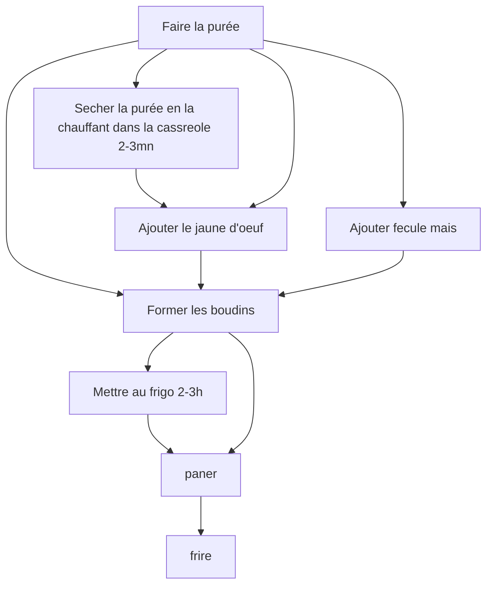

# Recette

- 300g patate
- 2 cas maizena

- faire une purée bien sèche
- optionnel: la sècher à feu doux 2-3 mn
- optionnel :
    - option 1: mettre du beurre dans la purée
    - option 2: ajouter un jaune d'oeuf
- optionnel : ajouter fecule de maïs
- optionnel : ajouter celeri (ou persil) haché
- optionnel : mettre au frigo 2-3h
- former des boudins
    - optionnel : mettre du fromage au coeur
- paner (farine, oeuf, chapelure)
- frire

# Variante : pomme dauphine
Puréé + pate à choux (1/3 du poids des patates